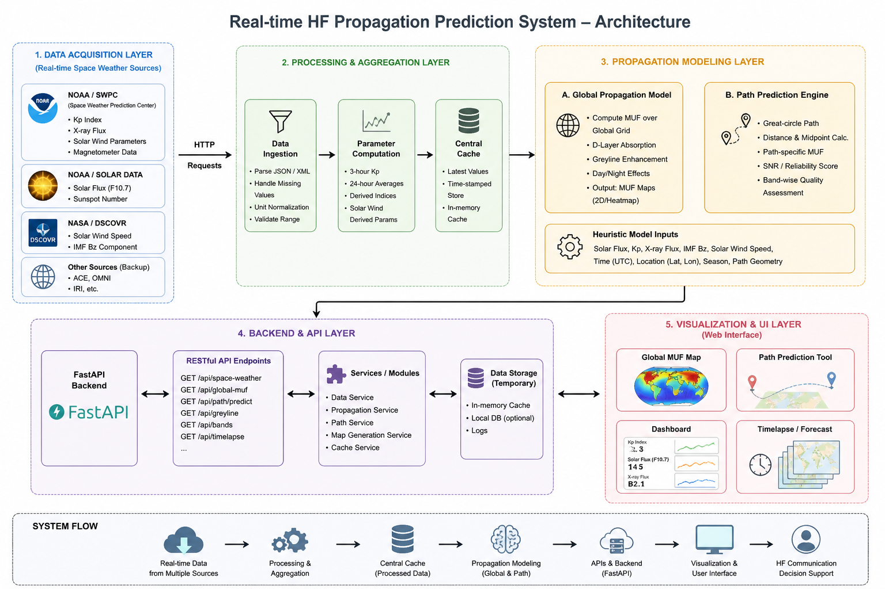
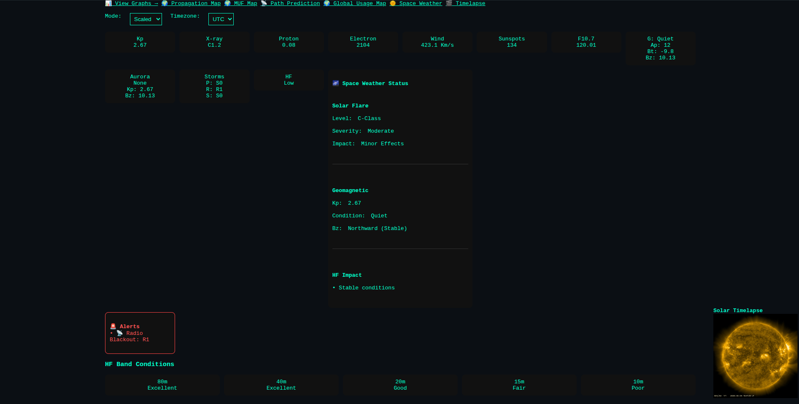
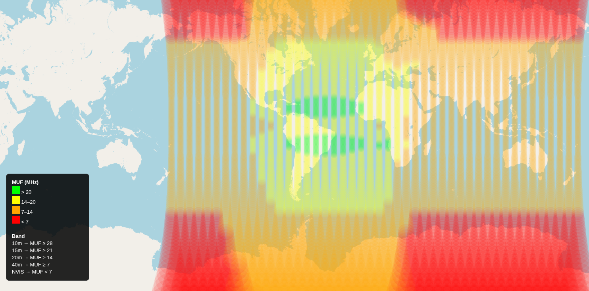
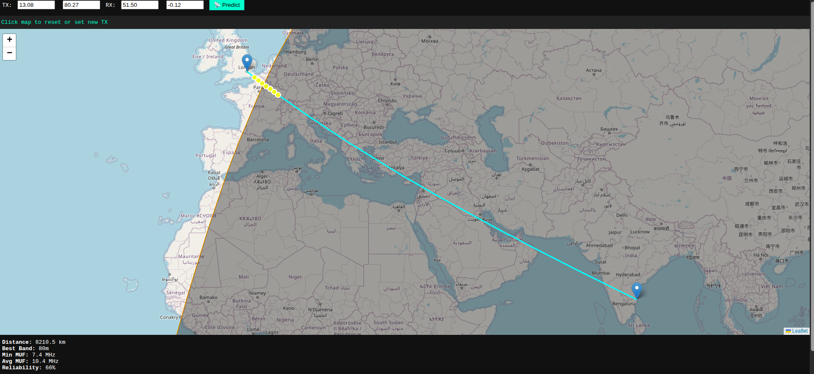

# Sarasvati Signals

Real-Time HF Propagation Intelligence Platform

## Project Status

Current Release: v1.0.0

Status: Active Development

## Overview

Sarasvati Signals is an open-source HF propagation intelligence platform
that combines live space weather data, ionospheric modeling, and
interactive visualizations to assist radio operators, researchers,
educators, and spectrum analysts in understanding HF propagation
conditions.

## Features

- Real-time Solar Flux monitoring
- K-index and geomagnetic activity monitoring
- Greyline propagation modeling
- F2 layer MUF estimation
- D-layer absorption estimation
- Ground conductivity modeling
- Angle-of-incidence path loss
- Polar absorption estimation
- Auroral absorption estimation
- Noise floor estimation
- Sporadic-E heuristic modeling
- Transequatorial propagation heuristic modeling
- Auroral scatter heuristic modeling
- Global HF propagation map
- Regional propagation map
- Point-to-point path prediction
- Space weather dashboard
- SDO imagery integration
- Automated SDO timelapse generation
- Space weather event detection
- Radio blackout alerting

## Architecture

## Architecture

The system consists of:

- Data Acquisition Layer
- Processing & Aggregation Layer
- Propagation Modeling Layer
- Backend API Layer
- Visualization Layer

## Installation

(see deployment.md)

## Data Sources

(see data_sources.md)

# HF Dashboard

Real-time monitoring of:

- Solar activity
- HF conditions
- MUF estimates
- Space weather alerts
- Radio blackout events

## Global MUF Visualization

## Path Prediction

Path quality is estimated using great-circle routing and MUF sampling along the path.

## Limitations

Current implementation is an experimental decision-support system and
should not be considered a replacement for ITU-R P.533 or VOACAP.

## License

MIT
