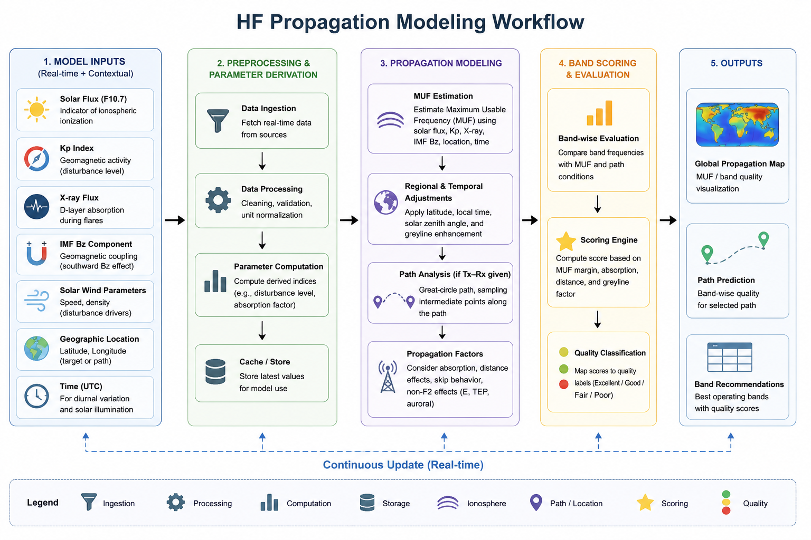

# Propagation Model

The propagation engine uses:

- Solar Flux (F10.7)
- Kp Index
- IMF Bz
- Solar Wind
- Geographic Location
- UTC Time

These parameters are combined to estimate MUF and band quality.
